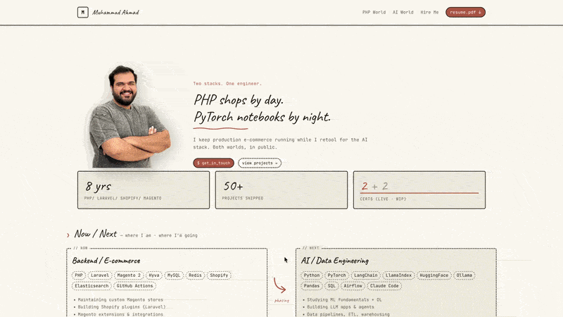

# Muhammad Ahmad Anwar — Portfolio

**Live site:** [muhammad-ahmad-anwar-portfolio.netlify.app](https://muhammad-ahmad-anwar-portfolio.netlify.app)

[](https://app.netlify.com/projects/subtle-sunburst-42a1bb/deploys)

---

<!-- Record a walkthrough GIF (e.g. with Kap or Cleanshot) and drop it here:

-->

---

## The Journey

This portfolio was built entirely using **Claude Code** — Anthropic's agentic coding tool — as an experiment in AI-assisted development. The goal wasn't just to ship a portfolio, but to see how far an LLM can take a project from blank repo to live production site.

### What was built

A personal portfolio for Muhammad Ahmad Anwar — MSc AI student and ex-backend PHP/Magento/Shopify engineer transitioning into AI/Data Engineering. The brief: position him as someone who bridges two stacks, not someone abandoning one for the other.

**Design concept:** "Polymath: PHP + AI" — a warm cream/terracotta paper aesthetic with monospace typography, wireframe-style dashed borders, and handwritten display headings. No frameworks. No component libraries. Pure CSS custom properties.

### How it was built

The build followed a structured 12-task handoff plan, executed in order with a commit after each task:

| Phase | What happened |
|---|---|
| **Foundation** | Astro v6 scaffold, design tokens, content collections, all section components built to wireframe spec |
| **Content** | Real project data, certifications, AI project pipeline, tech stack pills — all populated via conversation |
| **Images** | Transparent PNG profile photo with drop-shadow, 7 locally-cached project screenshots with Microlink CDN fallback |
| **Polish** | Mobile improvements, scroll offset fix, no-hash anchor navigation, cert stat color theory, favicon |
| **Deploy** | Netlify with auto-deploy on push, Forms detection, custom domain ready |

### Sections

- **Hero** — tagline + H1 + profile photo (transparent PNG, drop-shadow)
- **Stats** — 8 yrs · 50+ projects · 2 earned + 2 WIP certs (color-coded)
- **Now / Next** — PHP/e-commerce now → AI/Data Engineering next
- **Projects** — tabbed PHP production work + AI learning projects with status badges
- **Stack** — PHP World · AI/Data Engineering · Glue, plus certifications grid
- **Hire Me** — three service offerings
- **Contact** — Netlify Forms with async submit

### Tech

| Layer | Choice |
|---|---|
| Framework | Astro v6 (static output) |
| Content | Markdown content collections |
| Styling | Pure CSS custom properties — no Tailwind, no UI library |
| Fonts | Caveat (handwriting) + JetBrains Mono |
| Screenshots | Local cache + Microlink CDN fallback |
| Deploy | Netlify (auto-deploy on push to main) |
| Forms | Netlify Forms (zero backend) |

---

## Local Development

```bash
# Requires Node.js v22+
npm install
npm run dev      # localhost:4321
npm run build    # production build → dist/
npm run preview  # preview build locally
```

## Content Editing

| What | Where |
|---|---|
| Personal info, email, LinkedIn | `src/config.ts` |
| PHP / AI projects | `src/content/projects/*.md` |
| Service offerings | `src/content/services/*.md` |
| Tech stack pills | `src/components/TechStack.astro` |
| Now / Next bullets | `src/components/NowNext.astro` |
| Profile photo | `public/images/profile-nobg.png` |
| Project screenshots | `public/images/screenshots/[id].jpg` |
| Resume | `public/resume/Muhammad_Ahmad_Anwar_Resume.pdf` |

## Section Toggles

In `src/config.ts` — set any section to `false` to hide it:

```ts
sections: {
  nowNext:     true,
  learningLog: false,   // hidden — enable when study log data exists
  projects:    true,
  stack:       true,
  services:    true,
  contact:     true,
}
```

---

*Built with [Claude Code](https://claude.ai/code) + a lot of coffee ☕*
